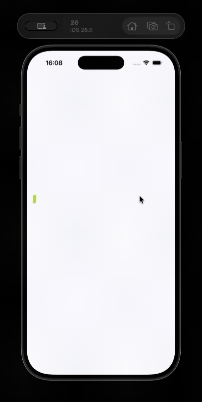

# 🎨 Flutter Animations Showcase


<p align="center">
  
  
</p>


A Flutter project focused on building **rich, smooth, and interactive animations** using Flutter’s powerful animation framework.  
This project serves as a **playground and reference** for implementing modern UI/UX animation patterns in Flutter applications.


## ✨ Features

### 🎬 Lottie Animations
- Seamless integration of Lottie JSON animations
- Optimized playback for performance
- Used for loaders, transitions, and visual storytelling

### 🃏 Animated Cards
- Interactive animated cards with smooth transitions
- Scale, rotation, and elevation-based animations
- Gesture-driven interactions (tap, swipe, drag)

### 📜 Advanced Scrolling Effects
- Custom scroll behaviors
- Parallax scrolling
- Page-based and physics-driven scrolling
- Animated reactions based on scroll position

### 🧲 Draggable Interactions
- Draggable and droppable UI elements
- Gesture-aware animations
- Real-time visual feedback during drag events

### ✂️ Clip & Custom Shapes
- Custom clip paths using `CustomClipper`
- Animated shape transformations
- Creative UI designs with clipped widgets

### 🧭 Navigation Animations
- Custom route transitions
- Fade, slide, scale, and shared element animations
- Smooth screen-to-screen navigation experiences

### ⏳ Animated Loaders
- Custom animated loading indicators
- Looping and progress-based loaders
- Lightweight and reusable loader components

### 🪟 Custom Pop-ups & Overlays
- Custom modal sheets
- Animated alert dialogs
- Bottom sheets with gesture-based animations
- Fully customizable popup UI


## 🛠 Tech Stack

- **Flutter**
- **Dart**
- **Lottie**
- **Custom Animations (Implicit & Explicit)**
- **Gesture & Scroll APIs**


## 🚀 Getting Started

### Prerequisites
- Flutter SDK
- Dart SDK
- Android Studio / VS Code

### Run Locally
```bash
flutter pub get
flutter run
